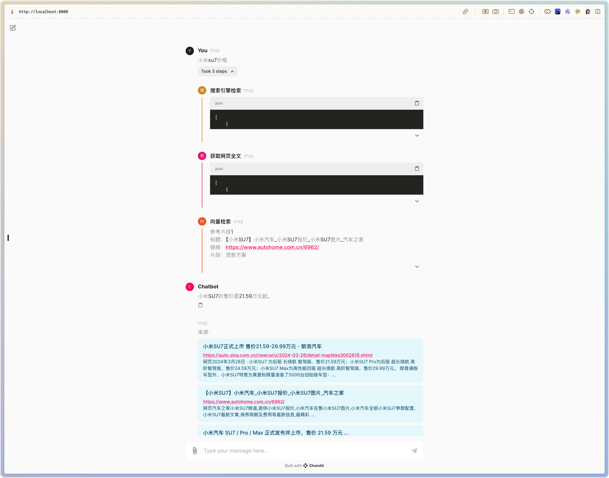

# 概述

本示例使用Ollama在本机部署一个大语言模型，无需使用相关API，借助Langchain和Chain构建一个AI搜索问答系统。在笔记本电脑上即可运行。



# 环境准备

- 操作系统：macOS、Linux、Windows系统均可，本示例在macOS环境下进行，未对Linux、Windows进行测试
- Ollama：从[Ollama官网](https://ollama.ai/)下载并安装Ollama即可
- Python 3.11.4环境可以正常使用，其他版本未做测试，理论上相关Python包可以安装都可以使用

# 快速开始

## 准备模型

在命令行中，执行如下命令，获取LLM和Embedding模型：

```bash
ollama pull qwen:7b
ollama pull znbang/bge:large-zh-v1.5-q8_0
```

## 安装依赖

```bash
pip install -r requirements.txt
```

## 启动

```bash
sh start.sh
```
# FAQ

## 输入问题后，网页可以正常检索、也可以获取到原文，但无法生成答案

可以按照以下步骤排查：

### 1. 检查Ollama是否可以正常返回Embedding

可以通过如下命令测试：

```bash
curl http://localhost:11434/api/embeddings -d '{
  "model": "znbang/bge:large-zh-v1.5-q8_0",
  "prompt": "为什么天空是蓝色的"
}'
```

如果等待比较长时间无法返回向量，或者返回为null，请升级Ollama到最新版本

### 2. 调整检索片段数量

排查Ollama的问题后，如果还是无法正常返回答案，可以尝试调整检索片段数量，避免由于片段较多，向量化过程超时导致问题

可以在app.py中的main方法中，在执行这句时`search_results_dict, retrieved_docs, context = await retrieve(query)`，增加参数k为一个比较小的数，比如`search_results_dict, retrieved_docs, context = await retrieve(query, k=2)`，再次重启服务，检查是否可以正常生成答案

### 3. 切换大语言模型为较小规模模型

如果没有GPU加速，并且计算机型号比较老，在生成最终答案时，就只能由CPU硬抗，此时可以先尝试将大语言模型切换为qwen1.5-0.5b，检查流程是否有问题

```bash
ollama pull qwen:0.5b
```

然后修改`app.py`文件的第14行
```python
model_name = 'qwen:7b'
```

修改为

```python
model_name = 'qwen:0.5b'
```

# 我的公众号

最近在公众号写一些关于大语言模型应用的文章，关注Langchain、Agen、Neo4j等话题，会定期开源一些样例项目，欢迎大家关注：

